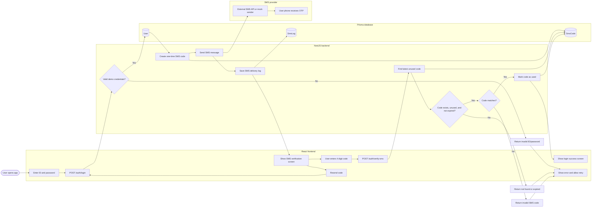

# SMS Login Flow

Use this Mermaid diagram in slides, GitHub, Notion, or any Mermaid renderer.
For a drag-and-drop slide asset, use [`sms-login-flow.svg`](./sms-login-flow.svg).

## Short Presentation Script

1. The user enters their ID and password in the React frontend.
2. The frontend calls `POST /auth/login` on the NestJS backend.
3. The backend checks the demo credentials, creates a short-lived one-time code, stores it in `SmsCode`, and sends the code by SMS.
4. The SMS send result is saved in `SmsLog` for delivery tracking and debugging.
5. The frontend moves to the verification screen, where the user enters the 4 digit code.
6. The frontend calls `POST /auth/verify-sms`.
7. The backend finds the latest unused code, checks that it has not expired, compares the code, then marks it as used.
8. If verification succeeds, the user reaches the success screen. If anything fails, the UI shows an error and lets the user retry or resend.

## Slide Title Ideas

- Secure Login With SMS Verification
- Two-Step Authentication Flow
- From Password Check to One-Time Code Verification
